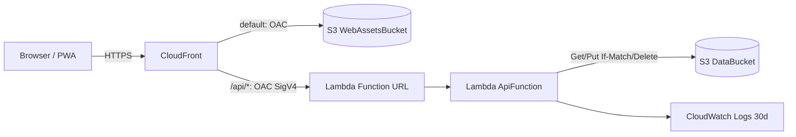

# Deployment Architecture - weight-fitness-app

**状態**: 設計・IaC実装のみ。**本PCからはデプロイしない**（ユーザーが別PCで実施）

## 構成図



テキスト版: ブラウザー → CloudFront。静的資産はOACでWebAssetsBucketへ、`/api/*`はOACでLambda Function URL → ApiFunction → DataBucket。ログはCloudWatch Logs。

## 費用見積もり（個人利用、東京リージョン、概算）

| サービス | 想定使用量/月 | 概算 |
|---|---|---|
| CloudFront | 数千リクエスト、数百MB | 無料利用枠内（1 TB/1,000万リクエスト）: 0円 |
| Lambda | 数千回 × 512 MB × 0.3秒 | 無料利用枠内: 0円 |
| S3 DataBucket | 画像 年間約0.5〜1 GB + 非現行版 | 1 GBで約$0.025（数円） |
| S3 リクエスト | 数千PUT/GET | 数円 |
| CloudWatch Logs | 数MB | 無料利用枠内 |
| 合計 | | **月額おおむね10〜50円程度**（利用量依存、為替・料金改定で変動） |

WAF・独自ドメイン・常時稼働リソースは含まない。正確な金額はデプロイ前にAWS Pricing Calculatorで確認すること。

## デプロイ前の承認チェックリスト（NFR-02 / NFR-07）

- [ ] デプロイ先AWSアカウントIDとリージョン（`ap-northeast-1`）を確認した
- [ ] URLを知る人がログインなしでデータを閲覧・更新できることを了承した
- [ ] 想定費用を確認した
- [ ] `DataBucket`はスタック削除後も残る（RETAIN）ことを理解した

## デプロイ手順（別PC）

```powershell
npm ci
npm run build
cd infra
npm ci
npx cdk bootstrap aws://<ACCOUNT_ID>/ap-northeast-1
npx cdk deploy
```

出力`AppUrl`がアプリのURLとなる。手順の詳細は`README.md`と`aidlc-docs/construction/build-and-test/build-instructions.md`を参照。
