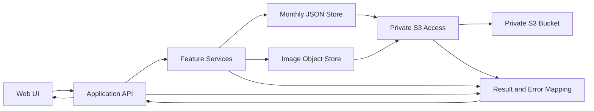

# コンポーネント依存関係

**状態**: 承認済み

## 依存関係マトリクス

| 利用側 | 依存先 | 通信・契約 |
|---|---|---|
| C-01 Web UI | C-02 Application API | HTTP要求と型付き成功／エラー応答 |
| C-02 Application API | C-03 Feature Services | 入力DTOとResult型 |
| C-02 Application API | C-07 Result and Error Mapping | AppErrorから安全なAPI応答への変換 |
| C-03 Feature Services | C-04 Monthly JSON Store | 月JSONの読取・条件付き更新 |
| C-03 FoodImageService | C-05 Image Object Store | バックエンド経由の画像保存・取得 |
| C-04 Monthly JSON Store | C-06 Private S3 Access | 月単位JSONオブジェクトの読み書き |
| C-05 Image Object Store | C-06 Private S3 Access | 画像オブジェクトの読み書き |
| C-06 Private S3 Access | Private S3 bucket | IAM権限を持つバックエンドからのみアクセス |
| 全バックエンド境界 | C-07 Result and Error Mapping | 型付き失敗と利用者向けエラー変換 |

## データフロー

テキスト版: Web UIはApplication APIだけを呼び出す。APIは機能別サービスを調整し、月JSONストアまたは画像ストアを呼ぶ。両ストアは共通のPrivate S3 Accessを通して非公開S3へアクセスする。失敗は型付きエラーとしてAPI境界まで戻り、安全な応答に変換されてUIに届く。

## 重要な境界

- ブラウザーからS3へ直接アクセスしない。AWS資格情報もブラウザーへ渡さない。
- JSONと画像のデータ転送はいずれもバックエンド経由とする（Application Design計画Q3-A）。
- すべてのURL利用者は同じデータを共有し、ログインや役割分離はない（FR-09）。
- 月JSONの更新は期待バージョンを使う抽象契約とし、具体的なS3条件付き書込方式はInfrastructure Designで確定する。
- 画像保存とJSON参照更新は別オブジェクトのため、部分成功時の回復動作はFunctional Designで定義する。
