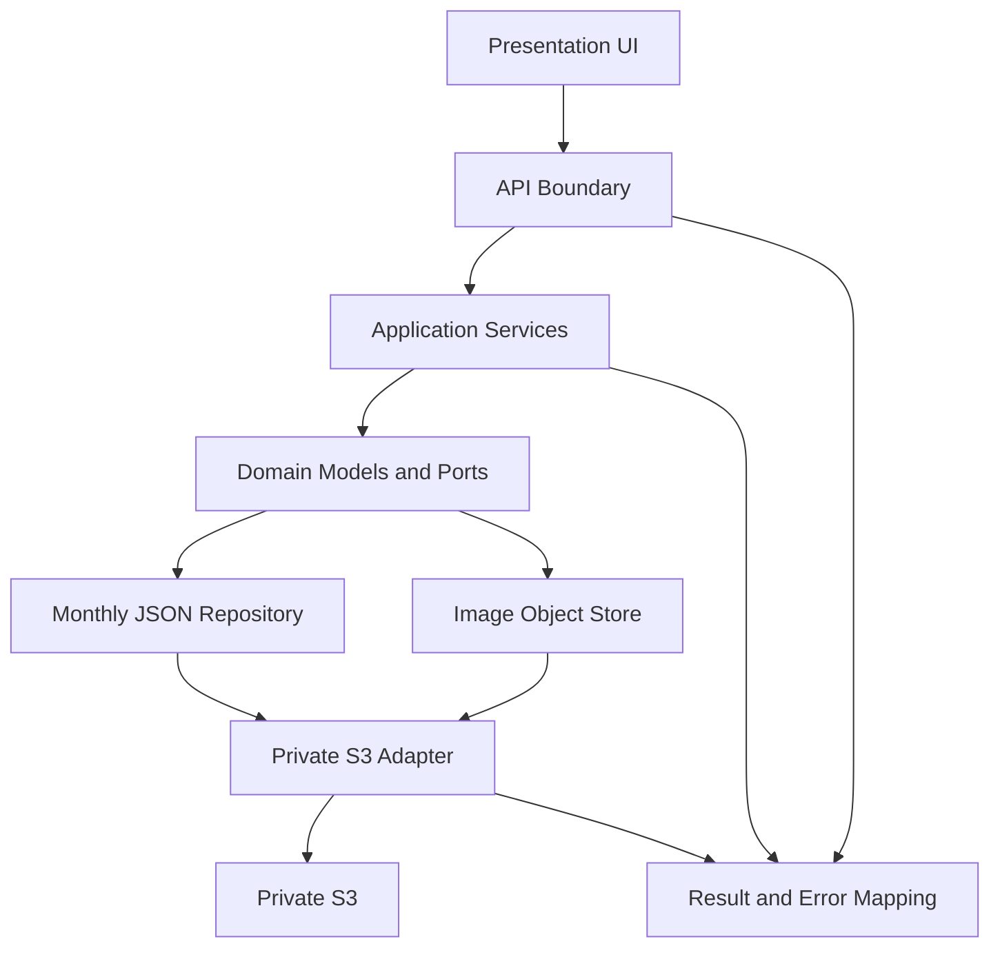

# Unit of Work 依存関係

**状態**: 承認済み  
**分割**: 単一Unit `UOW-01 weight-fitness-app`。Unit間依存なし。

## レイヤー依存マトリクス

| 利用側 | 依存先 | 契約・方向 |
|---|---|---|
| Presentation / Web UI | API client | Application APIの入力・出力型 |
| API boundary | Feature Services | コマンド／クエリDTOとResult型 |
| Feature Services | Domain models、Repository interfaces | 日付、体重、ミッション、目標、画像参照、versioned month document |
| Monthly JSON Repository | Private S3 adapter | 月単位JSONのread/write、version、Conflict |
| Image Object Store | Private S3 adapter | 画像オブジェクトのput/get |
| Private S3 adapter | AWS S3 | 非公開オブジェクトへのサーバー側アクセス |
| API / Services / Adapter | Result and Error Mapping | 型付きエラーから利用者向け応答への変換 |

## 依存フロー

テキスト版: UI → API → 機能サービス → ドメイン契約 → 月次JSON／画像ストア → 非公開S3アダプター → S3。型付きエラーは各境界から共通変換を経てUIへ戻る。

## 統合ルール

- すべてのレイヤーは同じコードベース、同じアプリ、同じリリース単位に含める。
- 下位レイヤーは上位UIやAPIに依存しない。
- JSONと画像の転送はバックエンド内で行い、ブラウザーからS3へ直接接続しない。
- `expectedVersion`に基づく競合通知はストア境界の契約とし、S3の具体的な条件付き書込方法はInfrastructure Designで決める。
- 画像保存と月次JSONの画像参照保存が部分成功した場合の整合処理はFunctional Designで定義する。
- 同一Unit内のレイヤー間実装順は共有型・契約、インフラストア、サービス、API、UIを基本とし、詳細は後続の生成計画に従う。
