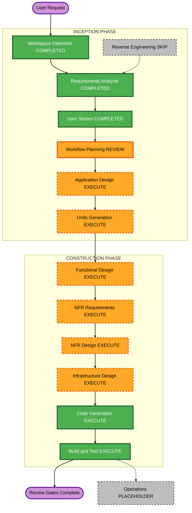

# Execution Plan

**状態**: ユーザーレビュー・明示承認待ち  
**プロジェクト**: 体重・運動管理Webアプリ（Greenfield）  
**参照**: `aidlc-docs/inception/requirements/requirements.md`、`aidlc-docs/inception/user-stories/stories.md`、`aidlc-docs/inception/user-stories/personas.md`

## 詳細分析

### スコープ

- **変革種別**: 新規システム構築。既存アプリや既存コンポーネントはない。
- **主な変更**: モバイル対応Web UI、日付単位の体重・運動・ミッション・画像記録、月間目標とカレンダー、JSON同期、手動バックアップ／復元／削除を設計・実装する。
- **関連コンポーネント**: UI、アプリケーションロジック、JSONデータ処理、画像保管、AWSインフラ、テスト。具体的な境界とサービス選択はApplication DesignとNFR設計で決める。

### 影響評価

- **ユーザー向け変更**: あり。毎日の記録と振り返りを支援する新規機能。
- **構造変更**: あり。新規アプリケーションとAWS配置構成を作る。
- **データモデル**: あり。日付別記録、ミッション、月間目標、画像参照、JSONインポート／エクスポートを定義する。
- **API・同期契約**: あり。複数端末の読み書きと競合時の振る舞いを設計する。
- **NFR影響**: 高い。健康情報、画像、未認証URLアクセス、同時更新、個人管理バックアップ、AWS費用が関係する。

### リスク評価

- **リスクレベル**: 高。ログインなしでURLを知る人が健康情報・画像を閲覧可能とする要件がある。
- **ロールバック複雑度**: 中。新規システムのためアプリ変更は切り戻せるが、AWS上の記録削除・復元やユーザー管理バックアップとの整合を考慮する必要がある。
- **テスト複雑度**: 中〜高。日次完了ルール、日付境界、最大2枚、同期競合、JSONと画像の往復を検証する。
- **デプロイ制約**: AWSアカウント、リージョン、アクセス方式、費用を提示して別途承認を得るまで、課金リソースの作成や公開を行わない。未認証公開のリスクもデプロイ直前に再確認する。

## Workflow Visualization

### テキスト版

INCEPTION: Workspace Detection（完了）→ Requirements Analysis（承認済み）→ User Stories（承認済み）→ Workflow Planning（本計画のレビュー待ち）→ Application Design（実施）→ Units Generation（実施）

CONSTRUCTION: Functional Design → NFR Requirements → NFR Design → Infrastructure Design → Code Generation → Build and Test（すべて実施）

Reverse EngineeringはGreenfieldのためスキップ。OperationsはAI-DLC v1ではプレースホルダー。AWSデプロイは上記の費用・アカウント・公開範囲の承認ゲートを満たすまで実施しない。

## 実施するフェーズ

### INCEPTION PHASE

- [x] Workspace Detection（完了）
- [x] Reverse Engineering（Greenfieldのためスキップ）
- [x] Requirements Analysis（承認済み）
- [x] User Stories（承認済み）
- [x] Workflow Planning（本計画の承認待ち）
- [ ] Application Design（実施）: UI、データ処理、ストレージ、同期境界が必要な新規アプリ。
- [ ] Units Generation（実施）: 日付記録・ミッション・画像のデータモデルと複数の実装単位を定義する。

### CONSTRUCTION PHASE

- [ ] Functional Design（実施）: 日次完了、ミッション、画像上限、JSON往復などの業務ルールを詳細化する。
- [ ] NFR Requirements（実施）: 性能・プライバシー・同期整合性・テスト技術を具体化する。PBT-09に従い言語とPBTフレームワークも選定する。
- [ ] NFR Design（実施）: データ保護、同期競合、エラー処理などの設計を行う。Security BaselineとResiliency Baselineは無効だが、承認済み要件の制約は適用する。
- [ ] Infrastructure Design（実施）: AWS構成、S3アクセス制御、費用見積もり、デプロイ前承認条件を具体化する。
- [ ] Code Generation（実施）: 承認済み設計に基づいて実装する。
- [ ] Build and Test（実施）: ビルド、例ベーステスト、選択済み範囲のPBT、同期・画像・バックアップ動作を検証する。

### OPERATIONS PHASE

- [ ] Operations（プレースホルダー）: AI-DLC v1の範囲では独立したOperationsワークフローを実行しない。実デプロイはAWS条件の承認後に限定する。

## 変更順序と依存

Greenfieldのため既存パッケージ間の更新順序は該当しない。設計後はデータ契約と共有モデルを先に確定し、それに依存するUI・ストレージ・同期実装を進める。AWSインフラへの配置はアプリの構成と見積もりが承認されるまで保留する。

## 概算

- **対象フェーズ数**: 12実施ステージ（Reverse Engineeringを除く）。うちWorkspace Detection、Requirements Analysis、User Storiesは完了。
- **残りのゲート**: Workflow Planning承認、Application Design、Units Generation、Construction 6ステージ。
- **期間**: 技術選定、AWS見積もり、受け入れ条件の詳細化後に見積もる。現段階で暦日・工数は断定しない。

## 成功基準

- **主要目標**: 承認済み要件とストーリーを満たす、体重・運動・食事画像管理アプリを構築する。
- **成果物**: 設計、実行単位、AWS構成と見積もり、実装、ビルド・テスト結果。
- **品質ゲート**: 各ステージの明示レビュー、日次完了・画像上限・同期・手動バックアップ／復元／削除の受け入れ条件、PBT部分適用ルール。
- **安全ゲート**: AWSアカウント、リージョン、未認証URLアクセス方式、想定費用を事前提示し、別途承認を得る。承認前はAWSリソースを作成・公開しない。
